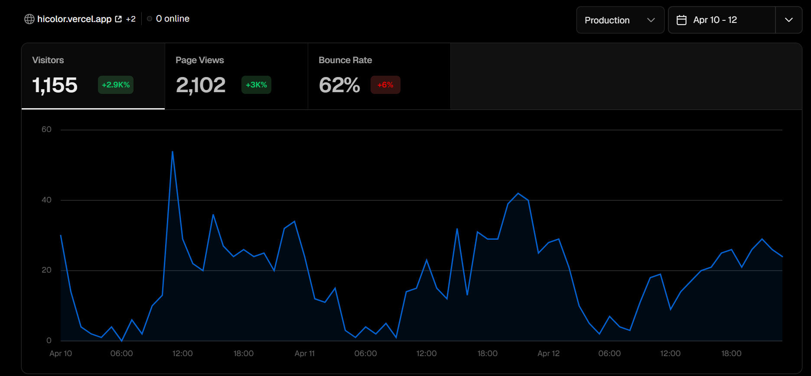
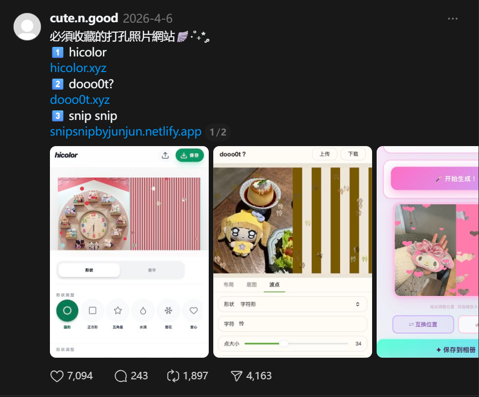

# Image2 to UI Skill

把 UI 截图、设计稿、App 参考图交给 Codex，生成可点击的网页或 App demo，并在需要真实视觉资产的位置调用 `image2` 生成位图。

Turn UI screenshots and design references into clickable Codex demos with code-rendered UI and real `image2` visual assets.

一句话：**一张 UI 参考图 -> 可点击 demo + 真正落地的生图资产。**

这个 skill 适合：

- 将 UI 参考图复刻成可预览、可点击的前端 demo
- 区分哪些内容应该用代码实现，哪些内容应该生成图片资产
- 为首屏主视觉、卡片缩略图、复杂插画、纹理、产品图、抠图等资产生成并接回页面
- 做手机 App 参考图时，交付带 iOS 外边框的可交互预览

[教程演示视频](https://v.douyin.com/MJLektzxKpM/)

## 为什么不一样

- 不是把整张 UI 烘焙成一张图片，而是保留真实可交互的文字、按钮和布局。
- 不是只用 CSS/SVG 临摹复杂视觉，而是把主视觉、插画、纹理、产品图等区域交给 `image2`。
- 最终目标不是一张截图，而是可打开、可点击、可继续改的 demo。

## Demo

<table>
  <tr>
    <th>参考图</th>
    <th>复刻预览</th>
  </tr>
  <tr>
    <td></td>
    <td><a href="./assets/demo.mp4"></a></td>
  </tr>
  <tr>
    <td>原始参考图</td>
    <td><a href="./assets/demo.mp4">点击查看原视频</a></td>
  </tr>
</table>

## 案例素材

### hicolor 增长案例

从 INS 视觉趋势出发，用 Codex 做成图片创作小工具并上线；上线 3 天获得 1,155 visitors / 2,102 page views。

<table>
  <tr>
    <th>三天访问数据</th>
    <th>传播证据</th>
  </tr>
  <tr>
    <td><a href="./assets/cases/hicolor/traffic-3-days.png"></a></td>
    <td><a href="./assets/cases/hicolor/threads-recommendation.png"></a></td>
  </tr>
  <tr>
    <td><a href="./references/hicolor-case-study.md">阅读完整 case study</a></td>
    <td><a href="./assets/cases/hicolor/xiaohongshu-pinned.jpg">查看小红书验证图</a></td>
  </tr>
</table>

### 博物馆 App

<table>
  <tr>
    <th>参考图</th>
    <th>复刻预览</th>
  </tr>
  <tr>
    <td><a href="./assets/cases/museum-app/reference-overview.png"></a></td>
    <td><a href="./assets/cases/museum-app/museum-app-demo.mp4"></a></td>
  </tr>
  <tr>
    <td><a href="./assets/cases/museum-app/reference-overview.png">原始参考图</a></td>
    <td><a href="./assets/cases/museum-app/museum-app-demo.mp4">点击查看原视频</a></td>
  </tr>
</table>

### 女装购物 App

<table>
  <tr>
    <th>参考图</th>
    <th>复刻预览</th>
  </tr>
  <tr>
    <td><a href="./assets/cases/fashion-shopping-app/reference-overview.png"></a></td>
    <td><a href="./assets/cases/fashion-shopping-app/fashion-app-demo.mp4"></a></td>
  </tr>
  <tr>
    <td><a href="./assets/cases/fashion-shopping-app/reference-overview.png">原始参考图</a></td>
    <td><a href="./assets/cases/fashion-shopping-app/fashion-app-demo.mp4">点击查看原视频</a></td>
  </tr>
</table>

### 新闻阅读 App

<table>
  <tr>
    <th>参考图</th>
    <th>复刻预览</th>
  </tr>
  <tr>
    <td><a href="./assets/cases/news-app/reference-overview.png"></a></td>
    <td><a href="./assets/cases/news-app/news-app-demo.mp4"></a></td>
  </tr>
  <tr>
    <td><a href="./assets/cases/news-app/reference-overview.png">原始参考图</a></td>
    <td><a href="./assets/cases/news-app/news-app-demo.mp4">点击查看原视频</a></td>
  </tr>
</table>

## 安装

Windows PowerShell：

```powershell
git clone https://github.com/zhu-guli326/image2_UI_skill.git "$env:USERPROFILE\.codex\skills\image2_UI_skill"
```

macOS / Linux：

```bash
git clone https://github.com/zhu-guli326/image2_UI_skill.git "${CODEX_HOME:-$HOME/.codex}/skills/image2_UI_skill"
```

安装后重开 Codex，或新开一个会话。

## 使用方式

上传 UI 参考图后，在 Codex 里直接说：

```text
使用 image-to-ui-skill，参考我上传的图，完成一个可点击预览的 demo。
需要真实调用 image2 生成必要的位图资产，并把生成结果接回页面。
技术栈用 HTML/CSS/JS。直接开始，不用先问我。
```

内部执行规则、资产规划细节和 image2 通道处理逻辑都在 `SKILL.md` 与 `references/` 中，Codex 触发 skill 后会自动读取。

Keywords: Codex skill, image2, image-to-ui, UI screenshot to code, design to code, clickable prototype, app demo, frontend demo, AI assets.
