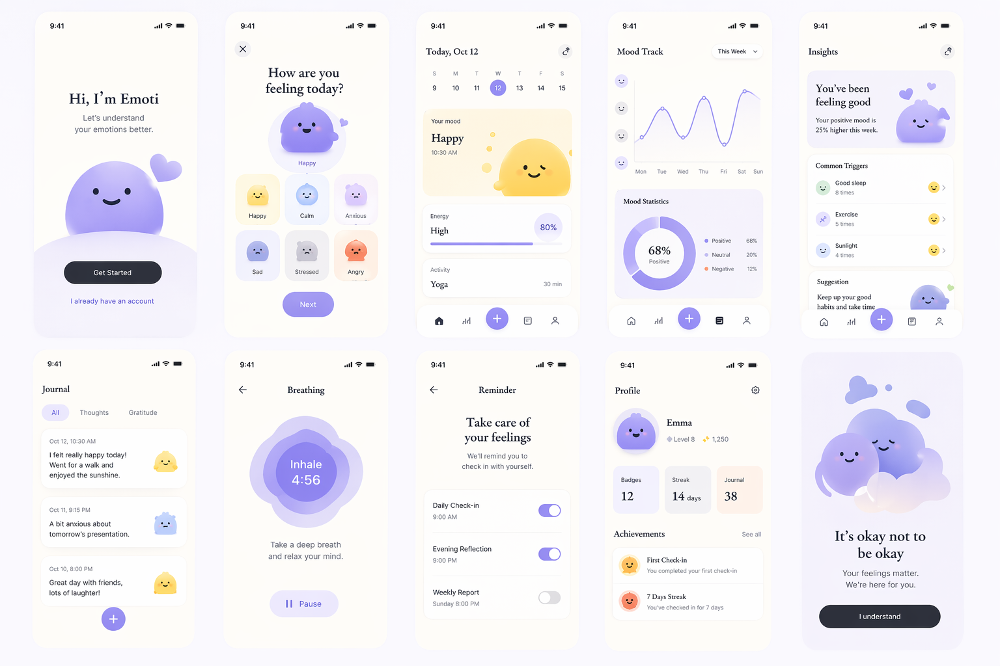
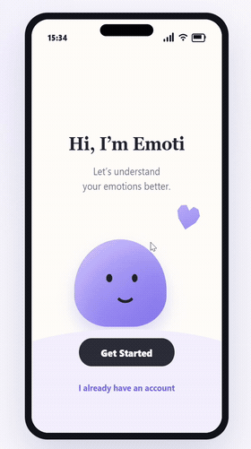
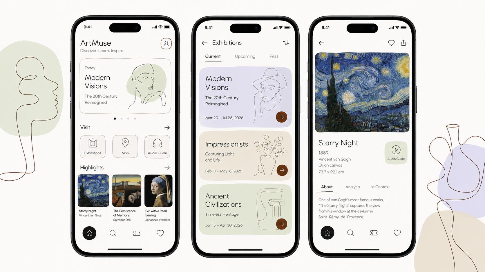
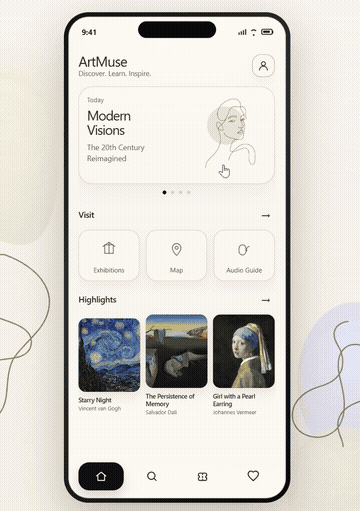
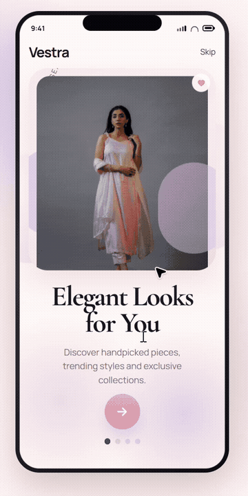
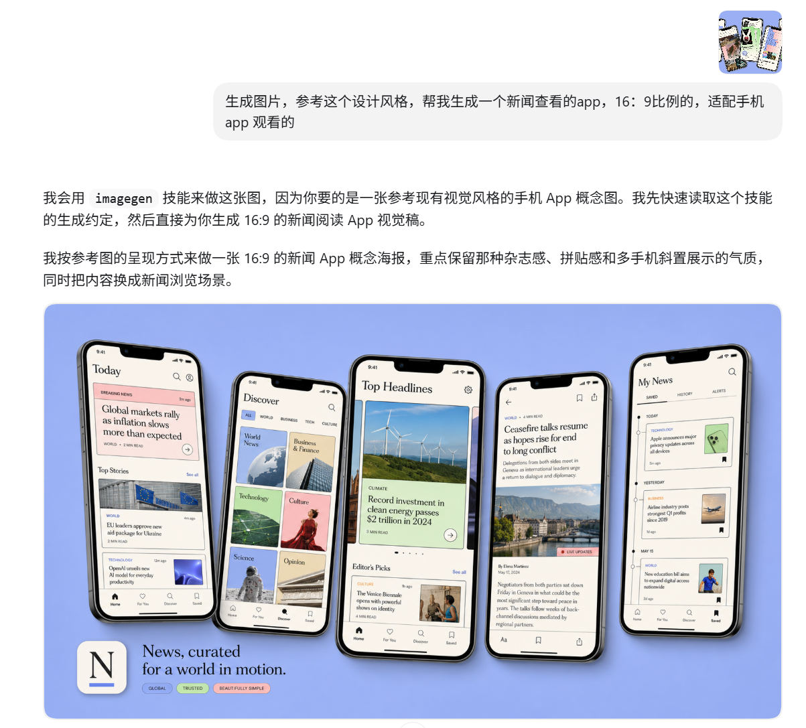

# Image2 to UI Skill  图片转UI界面

网页参考：

- [Dribbble](https://dribbble.com/)
- [Behance](https://www.behance.net/)
- [Pinterest](https://www.pinterest.com/)

基于 Codex 适配的图片转 UI 界面 skill。

把 UI 截图、设计稿、页面参考图转换成：

- 可用代码实现的结构化 UI
- 需要真实生成的 `image2` 位图资产

这个 skill 的重点不是“把截图大概做出来”，而是先判断哪些区域必须真实生图，哪些区域必须保留为代码，再把生成资产真正接回页面。

[教程演示视频](https://v.douyin.com/MJLektzxKpM/)

## 快速开始

<table>
  <tr>
    <th>参考图</th>
    <th>复刻预览</th>
  </tr>
  <tr>
    <td></td>
    <td><a href="./assets/demo.mp4"></a></td>
  </tr>
  <tr>
    <td>原始参考图</td>
    <td><a href="./assets/demo.mp4">点击查看原视频</a></td>
  </tr>
</table>

## 仓库案例素材

下面这些参考图和原视频已经直接放进仓库里，打开 GitHub 页面就能点开看。

### 博物馆 App

<table>
  <tr>
    <th>参考图</th>
    <th>复刻预览</th>
  </tr>
  <tr>
    <td><a href="./assets/cases/museum-app/reference-overview.png"></a></td>
    <td><a href="./assets/cases/museum-app/museum-app-demo.mp4"></a></td>
  </tr>
  <tr>
    <td><a href="./assets/cases/museum-app/reference-overview.png">原始参考图</a></td>
    <td><a href="./assets/cases/museum-app/museum-app-demo.mp4">点击查看原视频</a></td>
  </tr>
</table>

### 女装购物 App

<table>
  <tr>
    <th>参考图</th>
    <th>复刻预览</th>
  </tr>
  <tr>
    <td><a href="./assets/cases/fashion-shopping-app/reference-overview.png"></a></td>
    <td><a href="./assets/cases/fashion-shopping-app/fashion-app-demo.mp4"></a></td>
  </tr>
  <tr>
    <td><a href="./assets/cases/fashion-shopping-app/reference-overview.png">原始参考图</a></td>
    <td><a href="./assets/cases/fashion-shopping-app/fashion-app-demo.mp4">点击查看原视频</a></td>
  </tr>
</table>

### 新闻阅读 App

<table>
  <tr>
    <th>参考图</th>
    <th>复刻预览</th>
  </tr>
  <tr>
    <td><a href="./assets/cases/news-app/reference-overview.png"></a></td>
    <td><a href="./assets/cases/news-app/news-app-demo.mp4"></a></td>
  </tr>
  <tr>
    <td><a href="./assets/cases/news-app/reference-overview.png">原始参考图</a></td>
    <td><a href="./assets/cases/news-app/news-app-demo.mp4">点击查看原视频</a></td>
  </tr>
</table>

安装：

```powershell
git clone https://github.com/zhu-guli326/image2_UI_skill.git "$env:USERPROFILE\.codex\skills\image2_UI_skill"
```

安装后重开 Codex，或新开一个会话。

直接使用：

```text
使用 image-to-ui-skill。
参考我上传的图，完成一个可点击预览的 demo。

要求：
1. 先判断哪些部分应该用代码实现，哪些部分必须真实调用 image2 生图
2. 不要把标题、正文、按钮文字、价格做进图片里
3. 需要真实生成的位图资产，请实际生成并接回页面
4. 如果没有真实生成位图并接入页面，不要告诉我已经用了 image2
5. 最后告诉我生成了哪些图片、图片放在哪、哪些区域仍然是代码实现

技术栈：
- HTML/CSS/JS

直接开始，不用先问我。
```

## 这个 skill 解决什么问题

它适合处理这类任务：

- 你手上有一张 UI 图，想把它变成前端页面
- 你要做高保真还原，但又不想让模型只写 CSS 近似
- 你需要主视觉、插画、卡片图、背景纹理、抠图等真实位图资产
- 你希望最后拿到的是可点击、可预览、可继续改的页面

它不只是“生成几张图”，而是完整处理这一条链路：

1. 拆分代码 UI 和图片资产
2. 规划要生成的位图资产
3. 调用 `image2` 生成真实图片
4. 做必要的裁切、透明化、尺寸修正
5. 把资产接回页面
6. 检查页面渲染、交互和最终差距

## 工作流程

这个 skill 的标准流程是：

1. 先检查参考图，判断页面里哪些部分是代码 UI，哪些部分是图片资产
2. 输出前期审查和资产清单
3. 为必须生图的区域编写提示词
4. 调用 `image2` 生成真实位图
5. 做裁切、缩放、透明背景、尺寸修正等后处理
6. 把图片接回前端页面
7. 补齐可点击行为和页面跳转
8. 用截图核对最终结果和参考图差距

