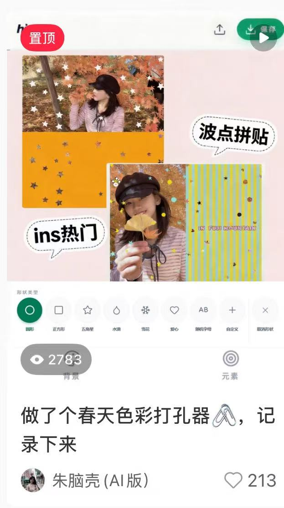

# Case study: hicolor, from INS trend to 1000+ visitors in 3 days

This case study is a real project story for `image-to-ui-skill`. It shows how a small visual trend was turned into a shipped web tool, and why the skill exists.

## Result

`hicolor` is a lightweight photo creation tool for making INS-style collage images with dot patterns, punched-photo shapes, stickers, and spring color palettes.

Within the first 3 days, the site reached:

- 1,155 visitors
- 2,102 page views
- 62% bounce rate

## What triggered the project

The starting point was not a product spec. It was a visual trend seen on INS:

- soft spring colors
- dot and stripe patterns
- sticker-like decorations
- photo collage composition
- a lightweight "make mine look like this" user need

The key judgment was simple: users did not need Photoshop or a full image editor. They wanted a one-click way to recreate a current visual style.

## Build path

The first version followed a small loop:

1. Find a visual trend on INS.
2. Turn the repeated visual pattern into a concrete tool idea.
3. Use Codex to build the web app UI and interaction flow.
4. Use the image2 workflow for visual areas that should not be faked with CSS.
5. Deploy quickly on Vercel.
6. Validate demand with a Xiaohongshu post.
7. Watch the project get recommended back into overseas feeds such as Threads.

## Where the UI got painful

The hard part was not the basic feature set:

- upload a photo
- choose a shape
- choose a dot or sticker style
- pick a background
- export the final image

The hard part was the boundary between code UI and visual assets.

For this kind of image creation tool:

- Buttons, sliders, upload controls, tabs, labels, and export actions should stay as code.
- Collage textures, sticker-like decorations, paper feel, and style-specific visual assets often need real image generation or prepared bitmap assets.
- Baking UI text into generated images makes the interface harder to edit, translate, interact with, or export correctly.
- Faking every visual area with CSS/SVG can make the first screenshot look acceptable while the actual tool feels cheap or breaks once a user uploads their own photo.

This is the exact gap that `image-to-ui-skill` tries to close.

## How this skill helps

When Codex receives a UI reference image, the skill forces a planning step before implementation:

- Which regions are code-rendered UI?
- Which regions are image2 bitmap assets?
- Which regions should use original user-provided materials?
- Which visible controls need real click behavior?
- Which assets must be generated, named, placed in the project, and wired back into the page?
- Which screenshots or validations prove the result actually renders?

For hicolor-like tools, this prevents a common failure mode: writing a large HTML/CSS approximation and treating it as a finished visual product.

## Asset boundary example

| Area | Recommended implementation | Why |
| --- | --- | --- |
| Upload button, save button, tabs, shape controls | Code UI | Must remain clickable and editable |
| Shape labels and tool text | Code UI | Should not be baked into images |
| Dot pattern preview and sticker-like decorations | image2 or local bitmap assets | Visual quality matters |
| User uploaded photo | Original user asset | Should not be regenerated by default |
| Final export canvas | Code composition + generated/local assets | Needs predictable output |
| Social preview screenshots | Rendered screenshots | Used for validation and promotion |

## Why this matters for technical communities

This is not only a growth story. It is a workflow case:

- A trend was discovered from a social feed.
- The trend was reduced into a small tool.
- AI coding was used to build the first version.
- Visual UI work was separated into code and image asset responsibilities.
- The app was deployed quickly.
- Demand was validated by real traffic and reposting.

That loop is useful for small products, AI coding demos, indie hacking experiments, and technical community posts.

## What this case teaches the skill

When a user asks Codex to recreate a visual creation tool, the agent should not jump straight into HTML/CSS.

It should first identify:

- the interaction model
- the export model
- which visual regions are likely to need image2
- which UI controls must remain code
- how to prove the result with a local page, screenshots, and click paths

The hicolor case is a reminder that the goal is not "a similar screenshot". The goal is a usable link that carries a visual trend into a working product.

